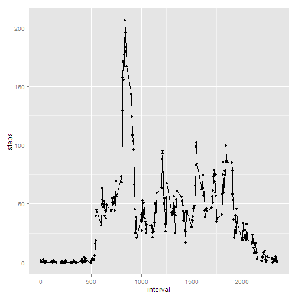

## Loading and preprocessing the data


```r
dat<-read.csv("activity.csv")
```

Process it so that the dates are POSIXct data types:


```r
dat$date<-as.POSIXct(dat$date,tz="UTC")
```

## What is mean total number of steps taken per day?

First, total the number of steps taken per day:

```r
# convert steps to numeric (previously was int)
dat$steps<-as.numeric(dat$steps,na.rm=T)
# aggregate the total steps per day
datSum<-aggregate(dat$steps,by=list(dat$date),FUN=sum,na.rm=TRUE)
# give proper date/steps column names
names(datSum)<-c("date","steps")
```

Plot a histogram of the total number of steps for each day:

```r
library(ggplot2)
qplot(data=datSum,steps,geom="histogram",binwidth=1000)
```

 

The mean number of steps is:

```r
# mean and median of total number of steps per day
mean(datSum$steps)
```

```
## [1] 9354.23
```

The median number of steps is:

```r
median(datSum$steps)
```

```
## [1] 10395
```
## What is the average daily activity pattern?

Now, the steps data are grouped together by common "interval", which is the 5 minute period during a day. These data are plotted.


```r
# take the average number of steps for each interval, across the entire day range
datDaily<-aggregate(dat$steps,by=list(dat$interval),FUN=mean,na.rm=TRUE)
names(datDaily)<-c("interval","steps")
# plot the number of steps over a day
qplot(data=datDaily,interval,steps)+geom_line()
```

 

To answer the question: Which interval contains the most steps on average:

```r
with(datDaily,interval[steps==max(steps)])
```

```
## [1] 835
```

## Imputing missing values

There are a number of NA values for steps in the data set.  The next pieces of code work to replace those NA values with something reasonable.

Calculate the number of NAs in the data set:


```r
datNA<-is.na(dat)
colSums(datNA)
```

```
##    steps     date interval 
##     2304        0        0
```

The method being used here is to replace each NA value with the mean number of steps at that particular interval. A new data set is created, called "datInterp".


```r
# since only the steps column has NAs, just select that column
datNA<-datNA[,1]
# strategy to replace NAs: loop through NAs and replace with median for each interval
datInterp<-dat
for (i in which(datNA != FALSE)) {
    # find which daily median matches the interval from the original data set
    datInterp$steps[i]<-datDaily$steps[which(datInterp$interval[i]==datDaily$interval)]
}
```

Make another histogram of the interpolated data set:


```r
# create a histogram of the interpolated data set for daily steps
# aggregate datInterp just like datSum
datInterpDaily<-aggregate(datInterp$steps,by=list(datInterp$date),FUN=sum)
names(datInterpDaily)<-c("interval","steps")

# plot a histogram of the interpolated daily step totals
qplot(data=datInterpDaily,steps,geom="histogram",binwidth=1000)
```

 

Again, the mean and median number of steps per day, but this time on the interpolated data set.

The mean:

```r
# mean
mean(datInterpDaily$steps)
```

```
## [1] 10766.19
```
The median:

```r
median(datInterpDaily$steps)
```

```
## [1] 10766.19
```

Note that the mean and median are significantly greater than the previously calculated mean and median. This is because additional values were included during interpolation.

## Are there differences in activity patterns between weekdays and weekends?

Next, a new column of the data set is created, which corresponds to whether the day is a weekday or weekend day.

A new factor variable is created:


```r
# identify which day of the week each date corresponds to
dayOfWeek<-weekdays(datInterp$date)
weekLevels<-c("weekday","weekend")
# a label is created for each of the unique days of the week; the order is important
dow<-factor(dayOfWeek,unique(dayOfWeek),labels=c("weekday","weekday","weekday","weekday","weekday","weekend","weekend"))
```

```
## Warning in `levels<-`(`*tmp*`, value = if (nl == nL) as.character(labels)
## else paste0(labels, : duplicated levels in factors are deprecated
```

```r
# apply the factor again to restrict to 2 levels
dow2<-factor(dow,levels=weekLevels)
# add an additional column to the interpolated data set
datInterp$dow<-dow2
```

Finally, the task is to make a panel plot showing the difference between weekday and weekend step trends.


```r
# aggregate over the interval and the day of week
datInterpDailyDOW<-with(datInterp,aggregate(steps,by=list(interval,dow),FUN=mean,na.rm=TRUE))
names(datInterpDailyDOW)<-c("interval","dayType","steps")
# construct a panel plot
qplot(data=datInterpDailyDOW,interval,steps)+facet_grid(dayType~.)+geom_line()
```

 

The end.
